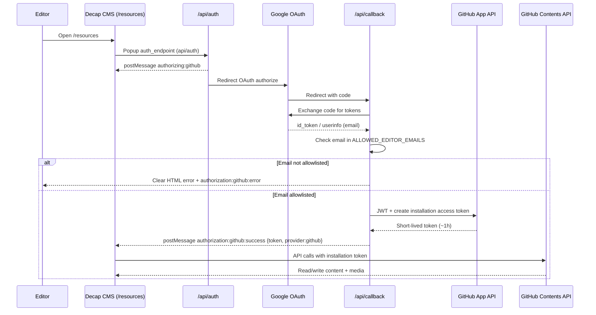

# Google AG AI — Resources Composer auth cutover

## Purpose

This document is a **work package for Google AG AI** (a coding agent). Implement the locked plan: move the Decap CMS Article Composer from `/admin` to `/resources`, replace GitHub OAuth login with **Google OAuth + email allowlist**, and mint short-lived **GitHub App installation tokens** so editors never need GitHub repo access.

Do **not** wait for a separate Cursor plan file. Everything needed to implement work packages WP1–WP4 is in this document and the current repo.

| Item | Value |
|------|--------|
| Repo (local) | `A:\Rolcc-website` |
| Repo (GitHub) | `rolccbangalore-star/rolcc-website` |
| Live site | `https://www.rolcc.in` (Vercel) |
| CMS | Decap CMS **3.3.0** (currently at `/admin`) |
| Deploy | Static site + Vercel serverless functions under `api/*.js` |

### Locked product decisions (do not reopen)

1. **Allowlist** of specific Gmail addresses via env `ALLOWED_EDITOR_EMAILS` (comma-separated).
2. **Google login** → server mints a short-lived **GitHub App installation token** → Decap keeps `backend: github`. Editors never need personal GitHub accounts or collaborator invites.
3. **URL rename** `/admin` → `/resources`, with a **permanent** redirect `/admin` → `/resources`.
4. Keep CSS/JS **`admin-*` class prefixes** and existing `rolcc.admin.*` storage keys. This is a **URL rename only**, not a class rename.

### Current auth (what you replace)

- `api/auth.js` — starts GitHub OAuth; posts `authorizing:github` then redirects to GitHub.
- `api/callback.js` — exchanges GitHub code for user OAuth token; posts Decap success message.
- `api/oauth-config.js` — `GITHUB_CLIENT_ID` / `GITHUB_CLIENT_SECRET`, success/error HTML pages, Decap `postMessage` handshake.
- `admin/config.yml` — `backend.name: github`, `auth_endpoint: api/auth`, repo `rolccbangalore-star/rolcc-website`.
- Parked notes: `admin/AUTH-PARKED.md` (archive/replace under WP4).

---

## What you SHOULD pick up (in-repo, code-complete)

Implement WP1–WP4 in order. Prefer one coherent feature branch and one commit (or a small stack) covering all four packages.

---

### WP1 — Route rename `/admin` → `/resources`

**Goal:** Composer lives at `https://www.rolcc.in/resources`. Old `/admin` URLs permanently redirect.

#### Steps

1. **Rename folder** `admin/` → `resources/` (git mv preferred so history is preserved).
   - All contents move with it: `index.html`, `config.yml`, `admin.css`, `admin-composer.js`, `admin-editor-fields.js`, `admin-import.js`, `admin-preview.js`, `templates/`, existing req docs, etc.

2. **Update `resources/index.html` asset and init paths**
   - Stylesheet/script URLs: `/admin/...` → `/resources/...` (keep filenames like `admin.css`, `admin-composer.js`).
   - `CMS.init({ config_url: ... })`: use `location.origin + "/resources/config.yml"`.
   - Client pathname normalize: today it redirects `/admin` → `/admin/index.html`. Change to `/resources` / `/resources/` → `/resources/index.html` (same pattern).
   - Keep `<meta name="robots" content="noindex" />`.
   - Page title / topbar subtitle may say **Resources** or **Article Composer** (calm church tone). Do not invent a new product brand.

3. **Update `vercel.json`**
   - Headers that target `/admin/config.yml`, `/admin/admin.css`, `/admin/admin-composer.js` → `/resources/...` equivalents. Prefer covering all cache-sensitive composer assets under `/resources/` if practical.
   - Rewrites that point at `/admin/config.yml` (including `/config.yml` → config) → `/resources/config.yml`.
   - Replace the current soft redirect:
     - From: `/admin` → `/admin/index.html` (non-permanent)
     - To permanent redirects:
       - `/admin` → `/resources` (and `/admin/` → `/resources/` if needed)
       - Prefer also `/admin/:path*` → `/resources/:path*` so deep links and bookmarked `config.yml` paths do not 404.
     - Add `/resources` → `/resources/index.html` (or equivalent) so the pretty URL works the same way `/admin` did.

4. **Soft-update docs that mention `/admin` as the live composer URL**
   - At minimum: `prompts/bible-study/README.md`, `prompts/bible-study/03-one-shot-prompt.md`, and any composer-facing notes that tell staff to “open `/admin`”.
   - Historical handoff docs under `resources/MOBILE-*.md` may keep path history but should note the URL is now `/resources` if you touch them; do not spend a large drive rewriting every archive note.

#### Explicit non-goals for WP1

- Do **not** mass-rename `admin-*` CSS classes, element IDs, or file basenames (`admin-composer.js` may stay).
- Do **not** rename `rolcc.admin.*` sessionStorage/localStorage keys.
- Do **not** add a public site nav link to `/resources`.

---

### WP2 — Google OAuth + allowlist (replace GitHub CMS login)

**Goal:** Staff sign in with Google. Only allowlisted emails receive a GitHub App installation token that Decap uses as a GitHub backend token. Handshake with Decap stays compatible.

#### Keep Decap config shape

In `resources/config.yml` (after rename):

```yaml
backend:
  name: github
  repo: rolccbangalore-star/rolcc-website
  branch: main
  base_url: https://www.rolcc.in
  auth_endpoint: api/auth
```

Update the top comment to point at `resources/AUTH.md` instead of parked GitHub OAuth notes. Do **not** switch to Netlify Identity, git-gateway, or a custom Decap backend.

#### Rewrite `api/oauth-config.js`, `api/auth.js`, `api/callback.js`

Match existing style: CommonJS `require` / `module.exports`, `async function handler(req, res)`, plain HTML string responses (same pattern as today).

##### Env vars the server must read

| Variable | Role |
|----------|------|
| `GOOGLE_CLIENT_ID` | Google OAuth client ID |
| `GOOGLE_CLIENT_SECRET` | Google OAuth client secret |
| `ALLOWED_EDITOR_EMAILS` | Comma-separated allowlist (normalize: trim, lowercase) |
| `GITHUB_APP_ID` | GitHub App ID |
| `GITHUB_APP_INSTALLATION_ID` | Installation ID on `rolccbangalore-star/rolcc-website` |
| `GITHUB_APP_PRIVATE_KEY` | PEM private key (may contain `\n` escapes in Vercel; normalize to real newlines) |
| `OAUTH_ORIGIN` | Optional override for site origin (existing helper already respects this) |

`missingConfigResponse` should mention the **new** required vars (not `GITHUB_CLIENT_ID` / `GITHUB_CLIENT_SECRET`). Old GitHub OAuth user-app env vars are obsolete for this flow; you may leave a short comment that they are unused after cutover.

##### Flow (implement exactly)

1. Decap opens popup to `/api/auth` (via `auth_endpoint`).
2. `api/auth.js`:
   - Build Google authorize URL (`https://accounts.google.com/o/oauth2/v2/auth`) with:
     - `client_id`, `redirect_uri` = `{origin}/api/callback`, `response_type=code`, `scope=openid email profile`, `access_type=online`, `prompt=select_account` (or equivalent so multi-account Gmail users can pick).
   - Emit Decap’s pre-redirect handshake (keep provider string **`github`** so Decap’s github backend still accepts the message):
     - `window.opener.postMessage("authorizing:github", allowedOrigin)` and the existing `"*"` fallback if present today.
   - Redirect the popup to Google.
3. Google redirects to `/api/callback?code=...`.
4. `api/callback.js`:
   - Exchange `code` for Google tokens (`https://oauth2.googleapis.com/token`).
   - Fetch user identity (e.g. `https://openidconnect.googleapis.com/v1/userinfo` or tokeninfo) and read **email** + email verification if available.
   - Reject clearly if email missing or not verified.
   - Compare email (lowercase/trim) against `ALLOWED_EDITOR_EMAILS`.
   - If **not** allowlisted: return a calm, clear HTML error page (no stack traces, no tokens). Also post Decap error form: `authorization:github:error:...` so the opener can recover. Message should say the account is not authorized to use Resources / Article Composer; contact church web admins. Status ~403.
   - If allowlisted: mint a **GitHub App installation access token** (~1 hour TTL):
     1. Create a JWT signed with `GITHUB_APP_PRIVATE_KEY` (RS256), claims `iat`, `exp` (~9–10 min), `iss` = `GITHUB_APP_ID`.
     2. `POST https://api.github.com/app/installations/{GITHUB_APP_INSTALLATION_ID}/access_tokens` with `Authorization: Bearer <jwt>`, `Accept: application/vnd.github+json`.
     3. Use the returned `token` as the Decap backend token.
   - Success page: keep Decap handshake compatible:

```text
authorization:github:success:{"token":"<installation-token>","provider":"github"}
```

     Same `postMessage` pattern as current `authSuccessPage` (origin + `"*"` fallback). Do **not** change the provider string to `google` in the Decap message — Decap’s github backend expects `github`.

##### Security requirements

- Never `console.log` tokens, JWTs, codes, or full Authorization headers.
- Allowlist check is **server-side only**; never trust a client-provided email for minting.
- On failure, prefer generic operator-safe messages; log only non-secret error codes/status.
- Token in the browser is inherent to Decap’s github backend — mitigate with allowlist + short-lived App token (do not invent a parallel session store in this WP).

##### Dependencies

Prefer Node built-ins + `fetch` (already used). If you need JWT signing for the GitHub App, use a small well-known approach:

- Prefer zero new deps if you can sign RS256 with Node `crypto` cleanly, **or**
- Add a minimal dependency only if necessary (document it in the report-back). Do not pull a large auth framework.

##### UX of error/success HTML

Calm church tone: clear prose, no flashy UI, no emoji. Title can say “Resources — Sign in” / “Sign-in failed”.

---

### WP3 — Composer UI copy

**Files (after rename):** `resources/admin-composer.js`, optionally small strings in `resources/admin-import.js` / `resources/index.html`.

#### Login

- Decap’s default github backend button often says “Login with GitHub”. After Google cutover, surface **Sign in with Google** (or equivalent) via existing composer chrome/CSS/JS patterns — rewrite button label text after CMS mounts if Decap still renders GitHub wording.
- Critical: `isLoginView` in `admin-composer.js` currently detects login by checking that the LoginButton text contains `"github"`. After you change copy to Google, **update that detector** so login view still works (e.g. match LoginButton visibility / “sign in” / “google”, not only `"github"`).

#### Logout

- Keep clearing Decap/github-related storage keys (existing regex `/github|netlify|decap|nc-|backside|backstage/i` pattern — do not remove github key clearing; the token is still a GitHub token).
- Logout still reloads cleanly.

#### Import / Contents API

- `admin-import.js` (and editor helpers) may keep `backend.getToken()` for GitHub Contents API calls. Soften user-facing errors that say “log in to GitHub” → “sign in” / “sign in with Google” where staff-visible.
- Do not redesign import UX.

#### Topbar / branding

- Subtitle may read `resources` or `article composer`. Keep ROLCC brand primary.

---

### WP4 — Docs in repo

1. **Replace/archive** `AUTH-PARKED.md`:
   - After folder rename it will be at `resources/AUTH-PARKED.md` (or delete it once replaced).
   - Create **`resources/AUTH.md`** as the living setup checklist for humans.

2. **`resources/AUTH.md` must include**
   - Overview of the flow (Google → allowlist → GitHub App installation token → Decap github backend).
   - Exact env var names (table above).
   - Google Cloud redirect URI: `https://www.rolcc.in/api/callback` (and note preview origins if `OAUTH_ORIGIN` / `VERCEL_URL` are used for non-prod).
   - How to **add/remove editors**: edit `ALLOWED_EDITOR_EMAILS` on Vercel and redeploy/restart as required by Vercel env propagation.
   - GitHub App permission expectation: **Contents** read/write on `rolccbangalore-star/rolcc-website`.
   - Reminder: do not commit secrets; PEM in Vercel may need `\n` escaping.
   - Point staff URL to `/resources`.

3. Soft-update any remaining “GitHub OAuth for CMS” comments in `config.yml` and nearby docs so future agents do not revive the parked collaborator-invite path.

---

## What you must NOT do (leave for humans / out of scope)

| Do not | Why |
|--------|-----|
| Create the Google Cloud OAuth client or client secret | Human / console work |
| Create the GitHub App, install it, or generate the private key | Human / console work |
| Set Vercel environment variables in the Vercel dashboard | Human; you only document names |
| Force-push, rewrite `main` history, or casually rotate production secrets | Safety |
| Implement Netlify Identity or rewrite Decap to git-gateway | Explicitly out of scope |
| Per-user roles / permissions matrix | Out of scope; allowlist is binary |
| Mass-rename `admin-*` CSS classes, IDs, or `rolcc.admin.*` keys | Locked decision |
| Add `/resources` to the public mega menu / footer | Not required; composer is staff-only |
| Log tokens or paste secrets into docs/commits | Security |

If human prerequisites are missing, still ship the code and list blockers in your report-back. Do not invent fake credentials.

---

## Human prerequisites checklist

Assume these may already exist, or treat missing ones as **blockers for live verification** (not blockers for shipping code):

- [ ] `GOOGLE_CLIENT_ID`
- [ ] `GOOGLE_CLIENT_SECRET`
- [ ] `ALLOWED_EDITOR_EMAILS` (comma-separated Gmail addresses)
- [ ] `GITHUB_APP_ID`
- [ ] `GITHUB_APP_INSTALLATION_ID`
- [ ] `GITHUB_APP_PRIVATE_KEY` (PEM; newlines handled)
- [ ] Google OAuth authorized redirect URI: `https://www.rolcc.in/api/callback`
- [ ] GitHub App installed on `rolccbangalore-star/rolcc-website` with **Contents: Read and write**
- [ ] Vercel production project env vars set for the above (and redeploy after changes)

Optional:

- [ ] `OAUTH_ORIGIN` if non-production/preview login must use a fixed origin

Obsolete after cutover (safe to remove from Vercel once new flow is confirmed):

- `GITHUB_CLIENT_ID` / `GITHUB_CLIENT_SECRET` (old GitHub user OAuth app for Decap)

---

## Architecture (sequence)



---

## Implementation constraints

1. **Stack:** Static HTML/CSS/JS site + Vercel serverless `api/*.js`. No new app framework.
2. **Style match:** Follow existing `api/*.js` CommonJS style. Composer JS uses `var`, IIFEs, and DOM helpers — stay consistent; do not TypeScript-ify.
3. **Church site standards:** Calm, clear, hospitable copy. No flashy login chrome, no emoji, no gamified UI.
4. **Security:**
   - Never log tokens or private keys.
   - Allowlist enforcement only on the server.
   - Keep `noindex` on the composer page.
   - No requirement to link `/resources` from public navigation.
5. **Decap compatibility:** Success/error `postMessage` protocol must remain `authorization:github:...` with `provider: "github"` even though humans authenticate with Google.
6. **Token model:** Browser-held GitHub token is inherent to Decap `backend: github`. Mitigation is allowlist + short-lived installation token. Do not claim beforeunload can revoke GitHub tokens (N/A); document TTL instead.
7. **Cache bust:** After editing composer CSS/JS, bump `?v=` query strings in `resources/index.html` as the project already does.

---

## File touch list (expected)

| Path | Action |
|------|--------|
| `admin/` → `resources/` | Rename directory (entire tree) |
| `resources/index.html` | Path updates, title/chrome, `CMS.init` config_url, pathname normalize |
| `resources/config.yml` | Comment/docs pointer; keep github backend + `auth_endpoint: api/auth` |
| `resources/admin-composer.js` | Google login copy; fix `isLoginView`; logout keys unchanged in spirit |
| `resources/admin-import.js` | Soften “GitHub” staff-facing login error strings if present |
| `resources/AUTH.md` | **Create** setup checklist |
| `resources/AUTH-PARKED.md` | Delete or archive after `AUTH.md` exists |
| `api/oauth-config.js` | Rewrite for Google + allowlist helpers + GitHub App mint + Decap pages |
| `api/auth.js` | Google authorize redirect + `authorizing:github` handshake |
| `api/callback.js` | Google code exchange, allowlist, mint token, success/error pages |
| `vercel.json` | Headers/rewrites for `/resources`; permanent `/admin` → `/resources` |
| `prompts/bible-study/README.md` | Soft-update `/admin` → `/resources` |
| `prompts/bible-study/03-one-shot-prompt.md` | Soft-update `/admin` → `/resources` |
| `docs/GOOGLE-AG-AI-RESOURCES-AUTH.md` | This instruction file (do not delete; optional one-line “implemented” note only if asked) |

Possibly touched if required by JWT signing choice:

- `package.json` / lockfile (only if a minimal JWT dependency is unavoidable)

Do **not** change public marketing pages, sitemap, or mega menu unless a stray `/admin` staff instruction appears there.

---

## Acceptance criteria

Before claiming done, verify as much as possible structurally/locally. Live Google/GitHub App checks may be blocked on human env — call that out explicitly.

### Must verify in code / local structure

- [ ] Folder is `resources/`; no remaining required runtime dependency on `admin/` path for composer assets.
- [ ] `resources/index.html` loads CSS/JS from `/resources/...` and inits config from `/resources/config.yml`.
- [ ] `vercel.json` serves/rewrites `/resources` correctly.
- [ ] Permanent redirect `/admin` → `/resources` (and preferably `/admin/*` → `/resources/*`).
- [ ] `backend.name` remains `github`; `auth_endpoint` remains `api/auth`.
- [ ] `api/auth.js` sends users to Google, not `github.com/login/oauth/authorize`.
- [ ] `api/callback.js` rejects non-allowlisted emails with a clear HTML error and does not mint a token.
- [ ] Allowlisted path mints installation token and posts `authorization:github:success:{token,provider}`.
- [ ] No secrets committed; no token logging added.
- [ ] Login UI copy / `isLoginView` works with Google wording.
- [ ] Logout still clears Decap/github token storage keys.
- [ ] `admin-*` classes and `rolcc.admin.*` keys were **not** mass-renamed.
- [ ] `resources/AUTH.md` exists with env var names, redirect URI, and add/remove editor instructions.
- [ ] Staff docs that say “open `/admin`” for publishing are soft-updated to `/resources`.

### Live checks (human env may be required)

- [ ] Allowlisted Gmail can open `/resources`, sign in with Google, list collections, edit, publish (commit appears as the GitHub App bot / installation identity).
- [ ] Non-allowlisted Google account is rejected with clear messaging and cannot publish.
- [ ] Visiting `/admin` redirects to `/resources`.
- [ ] Media upload and article import still work using `backend.getToken()`.
- [ ] After ~1h, expired token behavior is acceptable (re-login); document residual risk if not auto-refreshing.

---

## Suggested commit message

```text
feat(resources): Google allowlist auth and /resources composer URL

Move Decap CMS from /admin to /resources with a permanent redirect, replace
GitHub user OAuth with Google sign-in plus ALLOWED_EDITOR_EMAILS, and mint
short-lived GitHub App installation tokens for the existing github backend.
```

---

## How to report back

When finished, return a concise report with:

1. **Files changed** (paths + one-line purpose each).
2. **Env vars still needed from a human** (checklist of unset/unverified items). Exact names:
   - `GOOGLE_CLIENT_ID`
   - `GOOGLE_CLIENT_SECRET`
   - `ALLOWED_EDITOR_EMAILS`
   - `GITHUB_APP_ID`
   - `GITHUB_APP_INSTALLATION_ID`
   - `GITHUB_APP_PRIVATE_KEY`
   - Redirect URI confirmation: `https://www.rolcc.in/api/callback`
3. **What you verified** vs **what you could not verify live**.
4. **Residual risks**, including:
   - Installation token TTL (~1 hour); Decap may require re-login after expiry (beforeunload cannot revoke GitHub tokens — N/A).
   - Token still exists in browser storage while valid (mitigated by allowlist + short TTL).
   - Preview/deploy URLs need matching Google redirect / `OAUTH_ORIGIN` if testing off production.
   - Old `GITHUB_CLIENT_ID` / `GITHUB_CLIENT_SECRET` cleanup once production is confirmed.
5. **Any dependency added** for JWT signing (name + why).
6. **Follow-ups for humans only** (console clicks you did not perform).

Do not claim production is fully live until allowlisted login and publish are confirmed against real Vercel env, or clearly mark that confirmation as blocked on humans.
